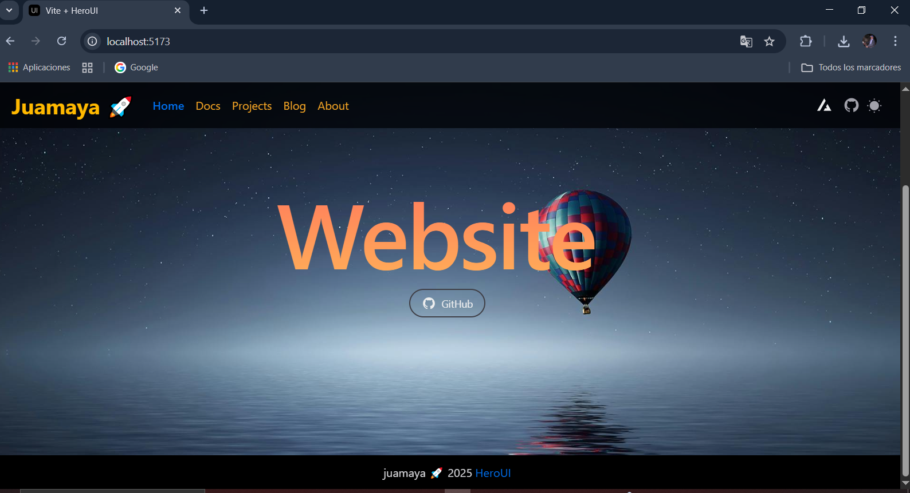

#  <font color="orange">Vite & HeroUI Template</font>


## ✅ Instalar HeroUI

```bash
npm install -g heroui-cli

```

## ✅ Create Project
>web-react-nextui


>This is a template for creating applications using Vite and HeroUI (v2).

```bash
heroui init web-react-nextui
```
# <font color="orange">App</font>



## 👉 How to Use

 

```bash

HeroUI CLI v1.2.3

√ Components data updated successfully!

T  Create a new project
|
o  Select a template (Enter to select)
|  Vite
|
o  New project name (Enter to skip with default name)
|  web-react-nextui
|
o  Select a package manager (Enter to select)
|  npm
|
o  Template created successfully!
|
o  Next steps ----------+
|                       |
|  cd web-react-nextui  |
|  npm install          |
|                       |
+-----------------------+
|
—  🚀 Get started with npm run dev
```

### 👉 Install dependencies

You can use one of them `npm`, `yarn`, `pnpm`, `bun`, Example using `npm`:

```bash
npm install
```

### 👉 Run the development server

```bash
npm run dev
```
 
## <font color="orange">🛠 </font>Technologies Used

- [Vite](https://vitejs.dev/guide/)
- [HeroUI](https://heroui.com)
- [Tailwind CSS](https://tailwindcss.com)
- [Tailwind Variants](https://tailwind-variants.org)
- [TypeScript](https://www.typescriptlang.org)
- [Framer Motion](https://www.framer.com/motion)


# ✅ Deploy Project

### 1. Tener lista la App

### 2.Crear un repositorio en tu cuenta de Github.com

### 3.Instalar gh-pages

```bash
npm install gh-pages --save-dev
```

 
### 4.Modificar vite.config.ts

>Añadir esto 

```bash
 
import { defineConfig } from "vite";
import react from "@vitejs/plugin-react";
import tsconfigPaths from "vite-tsconfig-paths";

// Determine if the build is production
const isProd = process.env.NODE_ENV === "production";

// https://vitejs.dev/config/
export default defineConfig({
  base: isProd ? "/web-react-nextui/" : "/", // Set correct base path for GitHub Pages
  plugins: [react(), tsconfigPaths()],
});


```


### 5.Modificar package.json

>Añadir esto 

```bash
 
import { defineConfig } from "vite";
import react from "@vitejs/plugin-react";
import tsconfigPaths from "vite-tsconfig-paths";

// Determine if the build is production
const isProd = process.env.NODE_ENV === "production";

// https://vitejs.dev/config/
export default defineConfig({
  base: isProd ? "/web-react-nextui/" : "/", // Set correct base path for GitHub Pages
  plugins: [react(), tsconfigPaths()],
});

```

## Las imagenes se deben importar para que se vean en produccion


```js

import { title } from "@/components/primitives";
import DefaultLayout from "@/layouts/default";
import { Avatar } from "@heroui/avatar";

import juan from "../images/juan.jpg"

export default function DocsPage() {
  return (
    <DefaultLayout>
      <section className="flex flex-col items-center justify-center gap-4 py-8 md:py-10">
        <div className="inline-block max-w-lg text-center justify-center">
          <h1 className={title()}>About</h1>
          <Avatar
          className="mt-5 "
            size="lg"
            isBordered
            color="warning"
            src={juan}
          />
        </div>
      </section>
    </DefaultLayout>
  );
}


```
## <font color="orange">Si estás usando react-router-dom, debes manejar correctamente las rutas para una SPA:</font>

### Para ver en modo desarrollo

> BrowserRouter

## <font color="orange">Añadir para el deploy: basename="/web-react-nextui" </font> 

> BrowserRouter basename="/web-react-nextui"

main.tsx

```js
import React from "react";
import ReactDOM from "react-dom/client";
import { BrowserRouter } from "react-router-dom";

import App from "./App.tsx";
import { Provider } from "./provider.tsx";
import "@/styles/globals.css";

ReactDOM.createRoot(document.getElementById("root")!).render(
  <React.StrictMode>
    <BrowserRouter basename="/web-react-nextui">
      <Provider>
        <App />
      </Provider>
    </BrowserRouter>
  </React.StrictMode>
);

```

### 5. Crear archivo yml
Crea el archivo de GitHub Actions
En tu proyecto, crea esta carpeta y archivo:

.github/workflows/deploy.yml

Y dentro de deploy.yml, pega esto:

```bash

    branches:
      - main  # Cambia esto si usas otra rama principal

permissions:
  contents: write  # Necesario para hacer push al branch gh-pages

jobs:
  deploy:
    runs-on: ubuntu-latest

    steps:
      - name: Checkout repository
        uses: actions/checkout@v4

      - name: Setup Node.js
        uses: actions/setup-node@v4
        with:
          node-version: 18

      - name: Install dependencies
        run: npm install

      - name: Build project
        run: npm run build

      - name: Deploy to GitHub Pages
        uses: peaceiris/actions-gh-pages@v4
        with:
          github_token: ${{ secrets.GITHUB_TOKEN }}
          publish_dir: ./dist
          publish_branch: gh-pages  # opcional pero recomendado

```

### 6. Ejecutar comando

```bash
npm run build
```

## ✅ Resultado

Cada vez que haces push a main, GitHub Actions:

Compila tu app.

Exporta a HTML estático.

Publica automáticamente en gh-pages.


## 🌐 Configura GitHub Pages

Ve a tu repositorio en GitHub → Settings → Pages.

En "Source", selecciona:

Branch: gh-pages

Folder: / (root)
___________________________________________________________________________________
